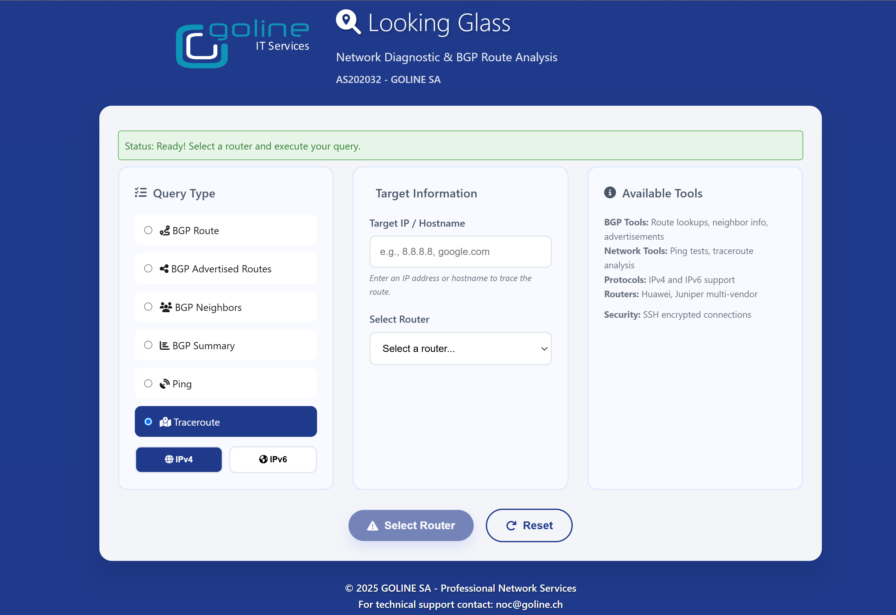

# &#x1F50D; GOLINE Looking Glass

**Modern, fast, and secure Looking Glass implementation in Go**

A high-performance network diagnostic tool for ISPs, hosting providers, and network operators. Supports multiple router vendors (Juniper, Huawei, Cisco) with a beautiful, responsive web interface and **real-time streaming** capabilities.

[](https://golang.org)
[](LICENSE)
[](https://hub.docker.com/r/paolokappa/goline-looking-glass)
[](Dockerfile)
[](#)

> **Author:** Paolo Caparrelli | **Company:** GOLINE SA 
> **Contact:** [noc@goline.ch](mailto:noc@goline.ch) | **AS:** AS202032

## &#x1F680; Features

- **High Performance**: Built in Go for maximum speed and efficiency
- **Real-time Streaming**: Live traceroute and ping output with hop-by-hop results
- **Multi-Vendor Support**: Juniper (Junos), Huawei (VRP), Cisco (IOS/IOS-XE)
- **Security First**: SSH authentication, rate limiting, input validation
- **Responsive Design**: Beautiful UI that works on all devices
- **Container Ready**: Docker and Kubernetes deployment options
- **Easy Setup**: Automated installation and configuration scripts
- **Customizable**: Full branding and theme customization
- **Comprehensive**: BGP routes, ping, traceroute, neighbor analysis
- **IPv6 Ready**: Full dual-stack IPv4/IPv6 support
- **Auto-scroll**: Follow command output in real-time

## &#x1F4A1; Use Cases

- **ISP Looking Glass**: Provide customers with network diagnostic tools
- **Hosting Providers**: Allow clients to test connectivity and routing
- **Enterprise Networks**: Internal network troubleshooting interface
- **Educational**: Network engineering training and demonstration
- **NOC Tools**: Quick network diagnostics for operations teams

## &#x26A1; Quick Start

### &#x1F433; Docker Hub (Recommended - Ready to Use)

**Pull and run the pre-built Docker image:**

```bash
# Pull from Docker Hub
docker pull paolokappa/goline-looking-glass:latest

# Run the container
docker run -d \
 --name goline-looking-glass \
 -p 3002:3002 \
 paolokappa/goline-looking-glass:latest

# Access at http://localhost:3002
```

** Docker Hub**: [paolokappa/goline-looking-glass](https://hub.docker.com/r/paolokappa/goline-looking-glass)

**Available tags:**
- `latest` - Latest stable version with streaming features
- `2.0.15-simple-streaming` - Specific version with real-time streaming

**Docker Compose example:**
```yaml
version: '3.8'

services:
 goline-looking-glass:
  image: paolokappa/goline-looking-glass:latest
  container_name: goline-looking-glass
  restart: unless-stopped
  ports:
   - "3002:3002"
  environment:
   - GIN_MODE=release
   - PORT=3002
  volumes:
   - ./logs:/app/logs
   - ./config.json:/app/config.json:ro
  healthcheck:
   test: ["CMD", "curl", "-f", "http://localhost:3002/api/health"]
   interval: 30s
   timeout: 10s
   retries: 3
   start_period: 40s
```

Then run:
```bash
docker-compose up -d
```

### &#x1F680; One-Line Installation

```bash
curl -sSL https://raw.githubusercontent.com/paolokappa/goline-looking-glass/main/scripts/install.sh | bash
```

### &#x1F527; Manual Installation

```bash
# Clone repository
git clone https://github.com/paolokappa/goline-looking-glass.git
cd goline-looking-glass

# Install dependencies and build
make setup
make build

# Configure your environment
cp config/company.example.json config/company.json
cp config/routers.example.json config/routers.json

# Edit configurations
nano config/company.json
nano config/routers.json

# Install system service
sudo make install

# Setup SSL (optional)
sudo ./scripts/setup-ssl.sh yourdomain.com noc@yourdomain.com
```

### &#x1F433; Docker Deployment from Source

```bash
# Quick start with Docker Compose
git clone https://github.com/paolokappa/goline-looking-glass.git
cd goline-looking-glass
docker-compose up -d
```

## &#x26A1; Real-time Streaming Features

This Looking Glass features **breakthrough real-time output streaming** for:

- ** Traceroute commands** - See each hop as it appears, hop-by-hop
- ** Ping commands** - Live packet results as they arrive
- ** Auto-scroll** functionality with manual override
- ** Stop/Resume** controls for long-running commands
- ** 5-minute timeout** for extended traces to distant destinations
- ** No more timeouts** - Commands complete successfully

### &#x1F4FA; Streaming Demo
The streaming interface shows live output like this:
```
traceroute to 8.8.8.8 (8.8.8.8), 30 hops max, 52 byte packets
 1 gateway (192.168.1.1) 1.234 ms 1.123 ms 1.456 ms
 2 provider.com (10.1.1.1) 15.678 ms 14.234 ms 16.123 ms
 3 backbone.net (203.0.113.1) 25.123 ms 24.567 ms 26.789 ms
[continues in real-time...]
```

## &#x2728; Supported Features

| Feature | Juniper | Huawei | Cisco | Description |
|---------|---------|--------|-------|-------------|
| **BGP Route Lookup** | Yes | Yes | Yes | Query specific routes in BGP table |
| **BGP Neighbors** | Yes | Yes | Yes | Display BGP peer status and info |
| **BGP Summary** | Yes | Yes | Yes | Overview of all BGP sessions |
| **Advertised Routes** | Yes | Yes | Yes | Routes advertised to specific peers |
| **Route Filtering** | Yes | Yes | Yes | Filter routes by community, AS-path |
| **Ping Tests** | Yes | Yes | Yes | ICMP connectivity testing |
| **Traceroute** | Yes | Yes | Yes | Network path analysis |
| **Real-time Streaming** | Yes | Yes | Yes | **NEW**: Live command output |
| **IPv6 Support** | Yes | Yes | Yes | Full dual-stack support |
| **AS Path Analysis** | Yes | Yes | Yes | BGP path information |
| **Community Strings** | Yes | Yes | Yes | BGP community filtering |

## &#x1F4F8; Screenshots

### Desktop Interface


### Mobile Interface 


### Command Results


## &#x1F4DA; Documentation

### Getting Started
- [Installation Guide](docs/installation.md) - Complete installation instructions
- [Configuration Guide](docs/configuration.md) - System and application configuration
- [Router Setup](docs/router-config.md) - Router-specific configuration
- [Customization](docs/customization.md) - Theming and branding options

### Deployment
- [Docker Deployment](docs/docker.md) - Container-based deployment
- [Kubernetes](docs/kubernetes.md) - Kubernetes deployment manifests
- [Cloud Deployment](docs/cloud.md) - AWS, GCP, Azure deployment guides

### Operations
- [Security Guide](docs/security.md) - Security best practices and hardening
- [Monitoring](docs/monitoring.md) - Monitoring and alerting setup
- [Troubleshooting](docs/troubleshooting.md) - Common issues and solutions
- [Performance](docs/performance.md) - Performance tuning and optimization

### Development
- [Development Setup](docs/development.md) - Local development environment
- [Contributing](docs/contributing.md) - How to contribute to the project
- [API Reference](docs/api.md) - REST API documentation
- [Testing](docs/testing.md) - Testing guidelines and procedures

## &#x2699;&#xFE0F; Configuration Examples

### &#x1F3A8; Company Branding
```json
{
 "company": {
  "name": "Your ISP Name",
  "as_number": "AS64512",
  "domain": "yourisp.com",
  "support_email": "noc@yourisp.com",
  "logo_path": "/images/logo.png",
  "theme": {
   "primary_color": "#1e3a8a",
   "secondary_color": "#667eea",
   "background": "navy"
  }
 }
}
```

### &#x1F50C; Router Configuration
```json
{
 "routers": [
  {
   "name": "Primary Core Router",
   "display_name": "NYC-Core-01",
   "hostname": "core1.yourisp.com",
   "type": "juniper",
   "username": "${ROUTER_USER}",
   "ssh_key": "/opt/looking-glass/keys/router_key"
  }
 ]
}
```

## &#x1F4CB; Requirements

### &#x1F5A5;&#xFE0F; System Requirements
- **OS**: Ubuntu 20.04+, CentOS 8+, RHEL 8+, Debian 11+
- **Memory**: 512MB RAM (1GB recommended)
- **CPU**: 1 vCPU (2+ recommended for high traffic)
- **Storage**: 1GB free space
- **Network**: SSH access to routers

### &#x1F4E6; Software Dependencies
- Go 1.21+ (for building from source)
- Apache 2.4+ or Nginx 1.18+ (for SSL termination)
- OpenSSH client
- Git
- Docker (for containerized deployment)

## &#x1F310; Live Demo

- ** GOLINE SA Production**: [https://lg.goline.ch](https://lg.goline.ch) - Live production instance with streaming
- ** Docker Quick Test**: `docker run -p 3002:3002 paolokappa/goline-looking-glass:latest`

## &#x1F4CA; Performance Benchmarks

| Metric | Value | Notes |
|--------|-------|-------|
| **Response Time** | < 50ms | Average API response time |
| **Concurrent Users** | 1000+ | Tested concurrent connections |
| **Memory Usage** | ~50MB | Typical memory footprint |
| **Command Execution** | < 5min | Maximum command timeout (streaming) |
| **Throughput** | 10,000+ req/min | Peak request handling |
| **Streaming Latency** | < 100ms | Real-time output delay |

## &#x1F50C; API Endpoints

### Standard Endpoints
- `GET /api/health` - Health check and version info
- `GET /api/routers` - Available routers list
- `POST /api/execute` - Execute network commands (standard)

### Streaming Endpoints
- `POST /api/execute-stream` - **NEW**: Execute with real-time streaming
- WebSocket endpoints for live updates

### Example API Usage
```bash
# Health check
curl http://localhost:3002/api/health

# Execute traceroute with streaming
curl -X POST http://localhost:3002/api/execute-stream \
 -H "Content-Type: application/json" \
 -d '{"query":"trace","addr":"8.8.8.8","router":"router1","protocol":"IPv4"}'
```

## &#x1F91D; Contributing

We welcome contributions from the community! Here's how you can help:

1. **Report Bugs**: Use [GitHub Issues](https://github.com/paolokappa/goline-looking-glass/issues)
2. **Feature Requests**: Propose new features via issues
3. **Pull Requests**: Submit code improvements
4. **Documentation**: Help improve documentation
5. **Testing**: Test on different platforms and configurations

See our [Contributing Guide](docs/contributing.md) for detailed information.

### Development Setup
```bash
# Fork and clone the repository
git clone https://github.com/yourusername/goline-looking-glass.git
cd goline-looking-glass

# Setup development environment
make setup

# Run tests
make test

# Build and run locally
make run
```

## &#x1F4C4; License

This project is licensed under the **MIT License** - see the [LICENSE](LICENSE) file for details.

### &#x1F4C4; License Summary
- Commercial use allowed
- Modification allowed
- Distribution allowed
- Private use allowed
- No liability
- No warranty

## &#x1F3E2; About GOLINE SA

**GOLINE SA** is a Swiss-based network services provider specializing in:
- Internet Transit and Peering (AS202032)
- Dedicated Server Hosting
- Network Infrastructure Solutions
- Cloud Connectivity Services

Learn more: [https://goline.ch](https://goline.ch)

## &#x1F468;&#x200D;&#x1F4BB; Author

**Paolo Caparrelli**
- **Company**: GOLINE SA
- **Email**: [noc@goline.ch](mailto:noc@goline.ch)
- **Website**: [https://goline.ch](https://goline.ch)
- **LinkedIn**: [Paolo Caparrelli](https://linkedin.com/in/paolocaparrelli)
- **GitHub**: [@paolokappa](https://github.com/paolokappa)

## Support ## &#x1F4AC; Support & Contact Contact

### Community Support
- **Bug Reports**: [GitHub Issues](https://github.com/paolokappa/goline-looking-glass/issues)
- **Discussions**: [GitHub Discussions](https://github.com/paolokappa/goline-looking-glass/discussions)
- **Documentation**: [GitHub Wiki](https://github.com/paolokappa/goline-looking-glass/wiki)

### Commercial Support
- **Technical Support**: [noc@goline.ch](mailto:noc@goline.ch)
- **Enterprise Inquiries**: [enterprise@goline.ch](mailto:enterprise@goline.ch)
- **Phone**: +41 XX XXX XX XX (Business hours: UTC+1)

### Quick Links
- ** Website**: [https://goline.ch](https://goline.ch)
- ** Network Info**: [AS202032 Details](https://bgp.he.net/AS202032)
- ** Live Demo**: [https://lg.goline.ch](https://lg.goline.ch)
- ** Docker Hub**: [paolokappa/goline-looking-glass](https://hub.docker.com/r/paolokappa/goline-looking-glass)

## &#x1F64F; Acknowledgments

Special thanks to:
- [Gin Web Framework](https://github.com/gin-gonic/gin) - HTTP web framework
- [SSH Library](https://golang.org/x/crypto/ssh) - SSH client implementation 
- [Go Community](https://golang.org) - Amazing programming language and ecosystem
- [Network Community](https://nanog.org) - Inspiration and feedback
- [Docker Community](https://docker.com) - Containerization platform
- **Contributors** - Everyone who has contributed to this project

## &#x1F4C8; Project Stats

[](https://github.com/paolokappa/goline-looking-glass/stargazers)
[](https://github.com/paolokappa/goline-looking-glass/network)
[](https://github.com/paolokappa/goline-looking-glass/issues)
[](https://github.com/paolokappa/goline-looking-glass/pulls)

---

**If you find this project useful, please consider giving it a star!**

*Built with by Paolo Caparrelli at GOLINE SA - Featuring breakthrough real-time streaming technology*
